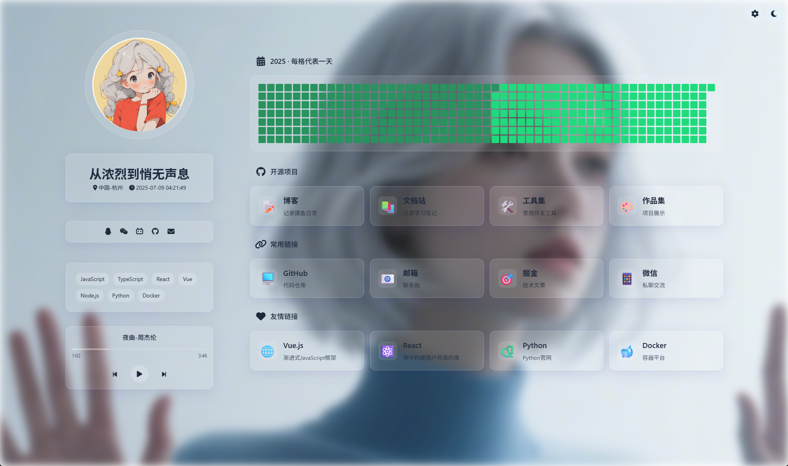
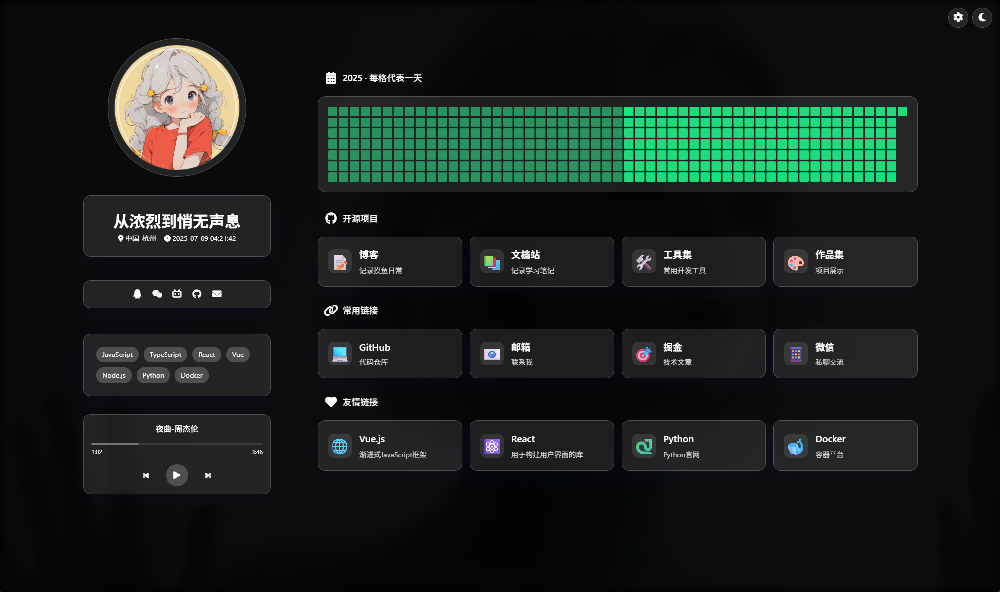
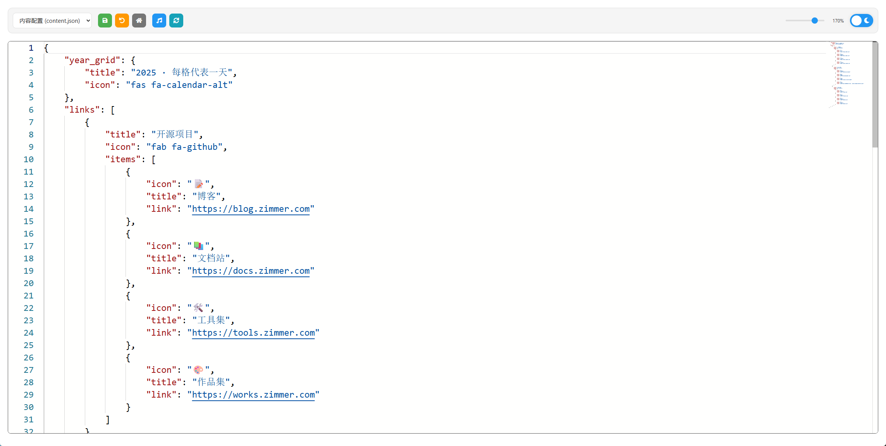

# 个人主页 v1.1.0

一个静态的个人导航页面，具有毛玻璃特效、动态头像、音乐播放器等特性

> 🚧 **持续优化中...**
>
> - 本项目处于开发中，会不断添加新功能和优化现有功能
> - 如果你有任何建议或想法，欢迎提出 Issue 或 PR





## ✨ 特

- 🌓 支持亮色/暗色主题切换
- 🎵 集成音乐播放器
- 🖼️ 动态头像效果（旋转和跳动动画）
- 🎨 可调节的毛玻璃效果
- 💠 精美的耳机装饰元素
- 📱 响应式设计，支持移动端
- 🔗 社交媒体链接（支持 QQ、微信、Bilibili、GitHub 等）
- 🏷️ 技能标签展示
- 🕒 实时时钟显示
- 🎯 可自定义的背景图片

## 🚀 快速开始

1. 克隆项目

```bash
cd Zimmer
```

2. 修改个人信息
   编辑 `data/profile.json` 文件，更新以下信息：

- 个人资料（姓名、头像、位置等）
- 社交媒体链接
- 技能标签
- 其他个性化设置

3. 运行项目

```bash
 npm install
 npm start
```

4. 在浏览器中访问 `http://localhost:3000`

## ⚙️ 自定义设置

### 主题设置

- 点击右上角月亮图标切换暗色/亮色主题
- 主题设置会自动保存到本地

### 毛玻璃效果调节

点击右上角设置图标，可以调节：

- 前景毛玻璃效果
- 背景毛玻璃效果
- 背景缩放
- 背景位置（水平/垂直）

### 音乐播放器

- 支持播放/暂停
- 上一首/下一首切换
- 进度条控制
- 实时显示播放时间
- 手动扫描功能：
  - 点击扫描按钮扫描 `public/music/` 目录
  - 支持的音频格式：mp3, wav, ogg, m4a
  - 自动提取音乐标签信息（歌手、标题等）
  - 支持子目录递归扫描
  - 实时反馈扫描结果

### 社交媒体

- 支持链接跳转
- 支持二维码显示
- 可自定义图标

## 📁 项目结构

```
.
├── css/
│   └── style.css          # 样式文件
├── js/
│   ├── main.js           # 主要逻辑
│   ├── theme.js          # 主题切换
│   ├── content.js        # 内容加载
│   └── social.js         # 社交链接处理
├── data/
│   └── profile.json      # 个人信息配置
├── public/
│   ├── images/          # 图片资源
│   └── favicon.svg      # 网站图标
└── index.html           # 主页面
```

## 🔧 技术栈

- HTML5
- CSS3 (动画、毛玻璃效果)
- JavaScript (原生)
- Font Awesome 6.5.1 (图标)
- Anime.js (动画库)

## 📝 配置说明

### profile.json 结构

```json
{
    "profile": {
        "title": "网站标题",
        "name": "你的名字",
        "avatar": "头像路径",
        "location": "所在地",
        "skills": ["技能1", "技能2"],
        "social": {
            "platform": {
                "icon": "图标类名",
                "url": "链接",
                "qrcode": "二维码图片路径"
            }
        }
    }
}
```

## 📝 配置文件说明

### data/profile.json

个人资料配置文件，包含：

```json
{
    "profile": {
        "title": "网站标题",
        "name": "你的名字",
        "avatar": "头像图片路径",
        "location": "所在地",
        "skills": [
            "技能1",
            "技能2"
        ],
        "social": {
            "platform": {
                "icon": "Font Awesome 图标类名",
                "url": "链接地址（可选）",
                "qrcode": "二维码图片路径（可选）"
            }
        }
    }
}
```

### data/playlist.json

音乐播放器配置文件（可选，如不配置则使用自动扫描）：

```json
{
    "playlist": [
        {
            "name": "歌曲名称",
            "artist": "艺术家",
            "cover": "封面图片路径",
            "url": "音乐文件路径",
            "lrc": "歌词文件路径（可选）"
        }
    ],
    "settings": {
        "musicDir": "public/music", // 音乐文件目录
        "recursive": true,          // 是否递归扫描子目录
        "formats": [               // 支持的音频格式
            "mp3",
            "wav",
            "ogg",
            "m4a"
        ]
    }
}
```

### data/settings.json

网站默认设置配置文件：

```json
{
    "theme": {
        "default": "light",    // 默认主题：light 或 dark
        "auto": false          // 是否跟随系统
    },
    "blur": {
        "foreground": 5,       // 前景毛玻璃效果（0-20）
        "background": 9,       // 背景毛玻璃效果（0-20）
        "scale": 150,         // 背景缩放比例（100-200）
        "position": {
            "x": 50,          // 背景水平位置（0-100）
            "y": 25           // 背景垂直位置（0-100）
        }
    }
}
```

### data/social.json

社交媒体配置文件（可选，也可以直接在 profile.json 中配置）：

```json
{
    "social": {
        "qq": {
            "icon": "fab fa-qq",
            "qrcode": "public/images/qq-qrcode.jpg"
        },
        "wechat": {
            "icon": "fab fa-weixin",
            "qrcode": "public/images/wechat-qr.png"
        },
        "github": {
            "icon": "fab fa-github",
            "url": "https://github.com/yourusername"
        },
        "email": {
            "icon": "fas fa-envelope",
            "url": "mailto:your.email@example.com"
        }
    }
}
```

### data/content.json

主页内容配置文件：

```json
{
    "content": {
        "sections": [
            {
                "title": "关于我",
                "type": "text",
                "content": "个人介绍内容"
            },
            {
                "title": "项目经历",
                "type": "projects",
                "items": [
                    {
                        "name": "项目名称",
                        "description": "项目描述",
                        "tags": ["标签1", "标签2"],
                        "link": "项目链接（可选）",
                        "image": "项目截图（可选）"
                    }
                ]
            }
        ]
    }
}
```

## 🔧 配置文件使用说明

1. **必需文件**

   - `profile.json`：个人基本信息，必须配置
   - `settings.json`：网站设置，必须配置
2. **可选文件**

   - `playlist.json`：如果需要音乐播放功能
   - `social.json`：如果社交媒体较多，可以单独配置
   - `content.json`：如果需要自定义主页内容
3. **配置建议**

   - 所有图片路径建议使用相对路径，从项目根目录开始
   - 图标建议使用 Font Awesome 6.5.1 免费版提供的图标
   - 配置文件支持注释，方便后期维护
   - 建议保留默认配置的备份
4. **文件关系**

   - `social.json` 中的配置会覆盖 `profile.json` 中的社交媒体配置
   - `settings.json` 中的设置可以被用户在界面上的修改覆盖
   - `content.json` 支持多种内容类型，可以灵活组合

## 📱 浏览器支持

- Chrome (推荐)
- Firefox
- Safari
- Edge

## 🤝 贡献

欢迎提交 Issue 或 Pull Request 来改进项目。

## 📄 许可

MIT License

## 🎵 音乐播放器使用说明

1. **手动扫描模式**（推荐）

   - 创建 `public/music` 目录
   - 将音乐文件放入该目录
   - 支持子目录分类存放
   - 点击扫描按钮更新播放列表
   - 实时显示扫描结果
2. **手动配置模式**

   - 编辑 `data/playlist.json`
   - 手动配置每首歌曲的信息
   - 适合需要特定播放顺序或额外信息的情况
3. **混合模式**

   - 可以同时使用手动扫描和手动配置
   - 手动配置的歌曲会被添加到扫描的列表中
   - 支持随时更新播放列表
4. **音乐文件要求**

   - 支持的格式：mp3, wav, ogg, m4a
   - 建议包含完整的音乐标签信息
   - 文件名格式建议：`歌手名 - 歌曲名.mp3`
5. **目录结构示例**

```
public/music/
├── 华语
│   ├── 周杰伦 - 稻香.mp3
│   └── 陈奕迅 - 富士山下.mp3
├── 日语
│   └── RADWIMPS - 前前前世.mp3
└── 英语
    └── Coldplay - Yellow.mp3
```

## 📅 更新日志

### 2025.7.10 (v1.1.0)

- ✨ 新增手动音乐扫描功能，移除自动扫描
- 🎨 优化配置中心界面布局
- 🔧 改进滚动条样式
- 🌈 优化响应式布局
- 🎵 完善音乐播放器交互体验

### 2025.7.9 (v1.0.0)

- ✨ 新增音乐播放器自动扫描功能
- 🎨 优化头像动画效果
- 🔧 完善配置文件结构

### 即将推出

- 📱 移动端适配优化
- 🎵 音乐可视化效果
- 🌙 主题色自定义
- 📊 更多的内容展示组件
- 🔍 站内搜索功能
- 📝 Markdown 内容渲染
- 🖼️ 图片懒加载优化
- 🎨 更多的动画效果
